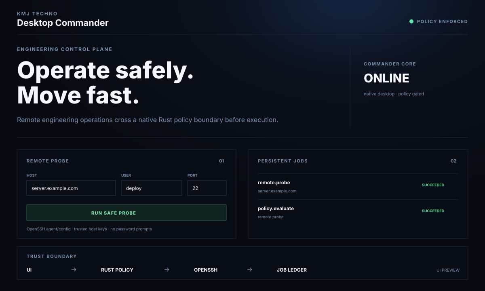

# KMJ Desktop Commander

<p align="center">
  <strong>Security-first desktop control for local and remote engineering work.</strong><br/>
  Run approved operations, inspect remote systems, track persistent jobs, and build AI-assisted workflows without handing an AI an unrestricted shell.
</p>

<p align="center">
  <a href="https://github.com/kmjtechno/kmj-desktop-commander/actions/workflows/ci.yml"></a>
  <a href="https://github.com/kmjtechno/kmj-desktop-commander/stargazers"></a>
  <a href="LICENSE"></a>
  
  
</p>

<p align="center">
  <a href="#quick-start"><strong>Quick start</strong></a> ·
  <a href="#what-works-today"><strong>What works today</strong></a> ·
  <a href="#security-model"><strong>Security</strong></a> ·
  <a href="CONTRIBUTING.md"><strong>Contribute</strong></a>
</p>

> ⭐ **If KMJ Desktop Commander is useful or you want to follow its development, [star the repository](https://github.com/kmjtechno/kmj-desktop-commander).** It helps more developers discover the project.

## One desktop control plane instead of five disconnected tools

Engineering work is often split across terminals, SSH sessions, CI pages, Git tools, dashboards, and AI assistants. **KMJ Desktop Commander** is being built to bring those workflows into one native, policy-controlled command surface.

The core rule is simple:

> **More autonomy for safe, reversible development work. More friction when the blast radius increases.**

Every native operation crosses a Rust policy boundary before execution. Unknown operations are denied by default.

## Current UI preview

<p align="center">
  
</p>

<sub>This preview reflects the current application layout and shipped foundation. Published signed installer screenshots/GIFs will replace or extend it as release artifacts become available.</sub>

## Why KMJ Desktop Commander?

| Capability | Commander approach |
|---|---|
| **Remote operations** | Scoped OpenSSH-backed actions instead of arbitrary shell access |
| **Security** | Native Rust policy engine with deny-by-default classification |
| **AI readiness** | AI can propose structured intent; native policy decides what may execute |
| **Accountability** | Operations are recorded in a persistent job ledger |
| **Desktop UX** | Tauri 2 + React + TypeScript native application |
| **Future automation** | Designed for project gates, Git workflows, remote runners, and controlled AI orchestration |

## Quick start

> **Current status:** source build / early development. Signed Windows, Linux, and macOS installers are not published yet.

### 1. Prerequisites

Install:

- a current **Node.js LTS**
- **pnpm**
- the **Rust stable toolchain**
- the platform prerequisites required by **Tauri 2**

### 2. Clone

```bash
git clone https://github.com/kmjtechno/kmj-desktop-commander.git
cd kmj-desktop-commander
```

### 3. Install dependencies

```bash
pnpm install
```

### 4. Run the native app

```bash
pnpm tauri dev
```

For the current remote probe, configure your normal OS OpenSSH client first. Commander uses your OpenSSH configuration/agent, requires the host key to be trusted already, and disables password prompts for the probe path.

## What works today

The repository currently includes:

- **Tauri 2** native desktop shell
- **Rust** security and policy boundary
- **React + TypeScript** interface
- deny-by-default operation policy
- explicit read-only, reversible, privileged, and destructive risk classes
- typed Tauri IPC between the webview and native core
- policy-gated **OpenSSH remote probing**
- host/user/port input hardening
- persistent job records for native operations
- remote operations dashboard
- minimal Tauri capability surface
- frontend and Rust CI quality gates
- architecture, security, contribution, and conduct documentation

## Security model

Commander intentionally does **not** expose an unrestricted shell-command API to its webview or future AI layer.

```text
React UI
   │ structured intent
   ▼
Tauri IPC
   │
   ▼
Rust Policy Engine ──► Approval Gate
   │
   ▼
Scoped Providers ──► Local / SSH / Git / CI
   │
   ▼
Verification + Persistent Audit/Job Records
```

Operations with larger blast radius are designed to require stronger policy and explicit approval. Examples include production deployment, privilege escalation, firewall changes, force-push, recursive deletion, and production database mutation.

Never commit SSH private keys, tokens, passwords, or production secrets. See [SECURITY.md](SECURITY.md).

## Quality gates

```bash
pnpm typecheck
pnpm build

cd src-tauri
cargo fmt --check
cargo clippy --all-targets --all-features -- -D warnings
cargo test
```

CI is defined in [`.github/workflows/ci.yml`](.github/workflows/ci.yml).

## Roadmap

Commander is being developed in secure vertical slices:

1. ✅ Secure desktop shell and policy engine
2. 🟡 SSH profiles, host verification, and scoped remote operations
3. 🟡 Persistent jobs, live logs, cancellation, and crash recovery
4. ⬜ Project discovery and quality-gate orchestration
5. ⬜ Git diff/review/commit/PR workflows
6. ⬜ OS-backed secret storage and signed audit history
7. ⬜ Kristi AI planner with policy-controlled execution
8. ⬜ Signed Windows, Linux, and macOS installers, secure updater, and release channels

Roadmap markers describe development progress, not stable-release guarantees.

## Built for developers who want automation without surrendering control

KMJ Desktop Commander is intended for developers, operators, and engineering teams that want a fast path from **intent → policy → execution → verification** while keeping privileged actions behind explicit native controls.

If that direction is useful to you:

**⭐ [Star KMJ Desktop Commander](https://github.com/kmjtechno/kmj-desktop-commander)** · **🐛 [Open an issue](https://github.com/kmjtechno/kmj-desktop-commander/issues)** · **🛠️ [Contribute](CONTRIBUTING.md)**

## Contributing

Issues and pull requests are welcome. Keep changes small, testable, security-conscious, and free of credentials or private infrastructure data.

Read [CONTRIBUTING.md](CONTRIBUTING.md) before submitting a change.

## License

Licensed under the Apache License 2.0. See [LICENSE](LICENSE).

## About

Created and maintained by **KMJ TECHNO**.

Copyright © 2026 KMJ TECHNO.
